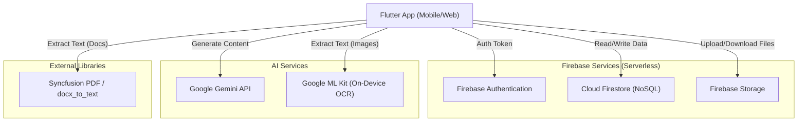
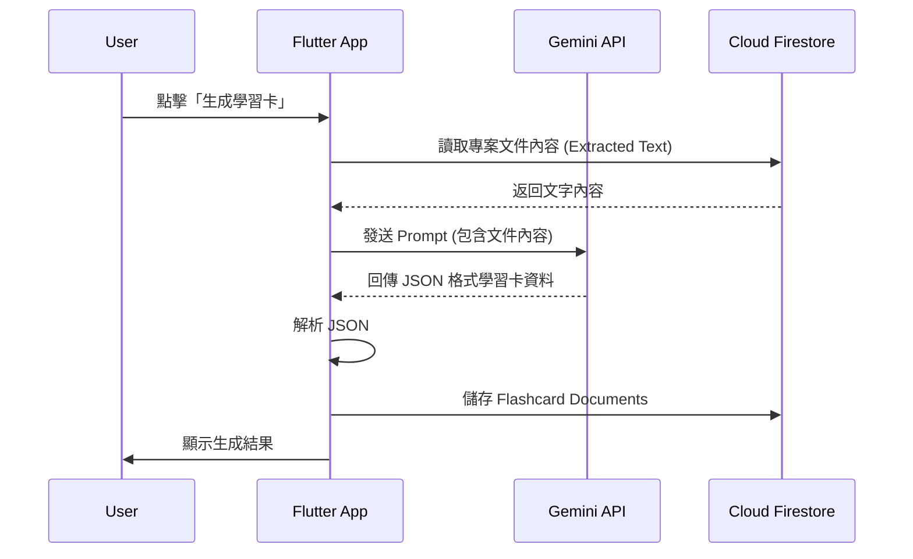
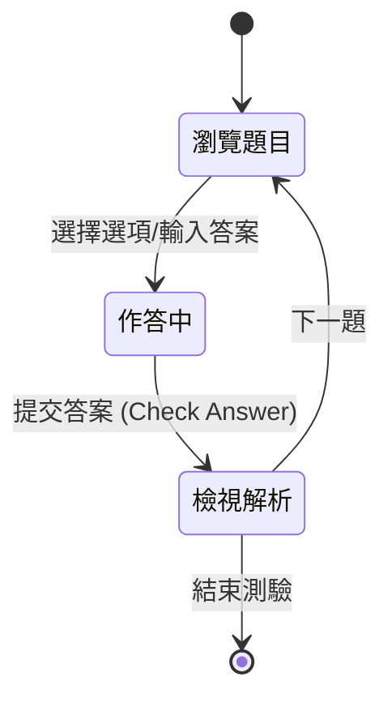
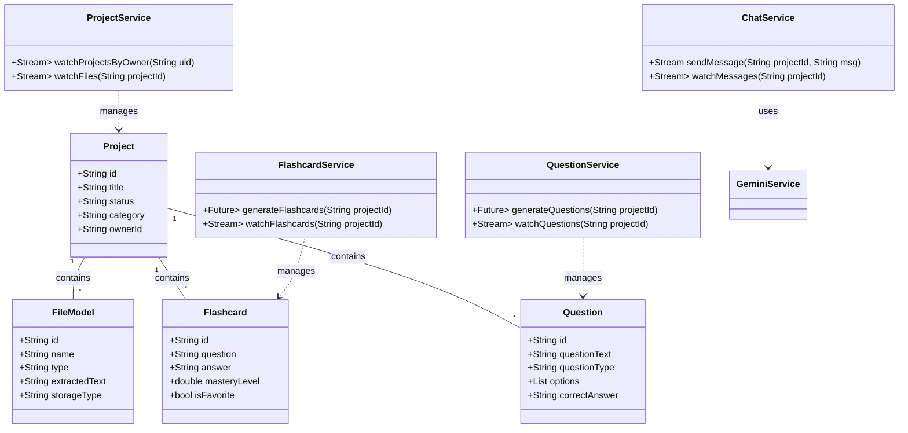

# 軟體設計文件(SDD)

**專案名稱：** Ghote 智慧學習輔助 App
**撰寫日期：** 2025/11/15
**發展者：** 專案團隊（5人）
- Team Lead 梁祐嘉
- Full Stack Engineer 李孟修
- Full Stack Engineer 楊泓立
- Full Stack Engineer 楊皓鈞
- Full Stack Engineer 蔡佩穎

---

## 版次變更記錄

| 版次 | 變更項目 | 變更日期 |
|------|----------|----------|
| 0.1 | 初版 | 2025/11/15 |
| 0.2 | 修正架構為 Serverless (Firebase) | 2025/11/20 |
| 1.0 | 正式版 | 2025/11/26 |
| 1.1 | feat: implement Clean Architecture and SOLID principles (a5f5886) | 2025/12/23 |
| 1.2 | feat: extract quiz widgets - QuizFeedback, QuizTypeLabel, QuizDifficultyLabel (1408629) | 2025/12/23 |
| 1.3 | feat: extract DashboardStatCard and FlashcardProgressHeader widgets (18154d3) | 2025/12/23 |
| 1.4 | docs: rename flashcard to learn card (抽認卡 → 學習卡) | 2026/01/04 |

---

## 目錄

1. [系統模型與架構 (System Model / System Architecture)](#1-系統模型與架構-System-Model--System-Architecture)
2. [Clean Architecture 與 SOLID 設計](#2-clean-architecture-與-solid-設計)
3. [介面需求與設計 (Interface Requirement and Design)](#3-介面需求與設計-Interface-Requirement-and-Design)
4. [流程設計 (Process Design)](#4-流程設計-Process-Design)
5. [使用者畫面設計 (User Interface Design)](#5-使用者畫面設計-User-Interface-Design)
6. [資料設計 (Data Design)](#6-資料設計-Data-Design)
7. [類別圖設計 (Class Diagram)](#7-類別圖設計-Class-Diagram)
8. [實作方案 (Implementation Languages and Platforms)](#8-實作方案-Implementation-Languages-and-Platforms)
9. [設計議題 (Design Issue)](#9-設計議題-Design-Issue)

---

## 1. 系統模型與架構 (System Model / System Architecture)

本系統採用 **Serverless (無伺服器)** 架構，以前端 Flutter 應用程式為核心，直接整合 **Firebase** 提供的後端即服務 (BaaS) 進行身份驗證、資料儲存與檔案管理。AI 功能透過 Google Generative AI SDK 直接在客戶端調用 Gemini API，實現去中心化的運算模式。


### 系統架構圖 (System Architecture Diagram)



---

## 2. Clean Architecture 與 SOLID 設計

本專案遵循 **Clean Architecture** 架構模式與 **SOLID** 設計原則，將業務邏輯與 UI/資料層分離，提升可測試性與維護性。

### 2.1 專案結構 (Project Structure)

```
lib/
├── core/
│   └── di/                        # 依賴注入
│       └── service_locator.dart   # ServiceLocator (DI Container)
├── features/
│   └── project/                   # Feature Module
│       ├── presentation/
│       │   └── widgets/           # 可重用 UI 元件
│       │       ├── file_list_item_widget.dart
│       │       ├── project_stats_card.dart
│       │       ├── ai_actions_bar.dart
│       │       └── learning_progress_card.dart
│       ├── domain/
│       │   ├── repositories/      # Repository 抽象介面
│       │   │   └── project_repository.dart
│       │   └── usecases/          # Use Cases (單一職責)
│       │       ├── delete_file_usecase.dart
│       │       ├── watch_files_usecase.dart
│       │       └── upload_file_usecase.dart
│       └── data/
│           └── repositories/      # Repository 實作 (Firebase)
│               └── project_repository_impl.dart
├── models/                        # 資料模型
├── services/                      # 業務服務層
├── screens/                       # 頁面 UI
└── utils/                         # 工具類
```

### 2.2 SOLID 原則應用

| 原則 | 應用說明 |
|------|----------|
| **S**ingle Responsibility | 每個 Use Case 只負責一項操作 (如 `DeleteFileUseCase`) |
| **O**pen/Closed | Widget 透過 callback props 擴展功能，無需修改內部實作 |
| **L**iskov Substitution | `ProjectRepositoryImpl` 可被任何實作 `ProjectRepository` 的類替換 |
| **I**nterface Segregation | Repository 介面只包含相關方法，不強迫實作不需要的功能 |
| **D**ependency Inversion | 高層模組 (Screens) 依賴抽象介面 (Repository)，而非具體實作 |

### 2.3 依賴注入 (Dependency Injection)

透過 `ServiceLocator` 管理單例實例：

```dart
// 使用方式
final deleteFileUseCase = sl.deleteFileUseCase;
await deleteFileUseCase(projectId: 'xxx', fileId: 'yyy');
```

---

## 3. 介面需求與設計 (Interface Requirement and Design)

### 2.1 外部介面 (External Interfaces)

| 介面名稱 | 介面提供者 | 介面使用者 | 連結方式 | 輸入資料 | 輸出資料 | 介面描述 |
|---|---|---|---|---|---|---|
| **User Auth** | Firebase Auth | Flutter App | SDK | Email/Password, Google OAuth | User UID, ID Token | 處理使用者註冊、登入與狀態管理 |
| **Database** | Cloud Firestore | Flutter App | SDK | JSON Documents | Document Snapshots | 即時同步的 NoSQL 資料庫 |
| **File Storage** | Firebase Storage | Flutter App | SDK | File Bytes | Download URL | 儲存使用者上傳的文件與圖片 |
| **Generative AI** | Google Gemini | Flutter App | SDK (gRPC/REST) | Prompt, Text/Image Content | Generated Text/JSON | 提供筆記整理、題目生成與聊天功能 |

### 2.2 內部服務介面 (Internal Service Interfaces)

| 介面名稱 | 實作類別 | 描述 |
|---|---|---|
| **ProjectService** | `ProjectService` | 封裝 Firestore 操作，管理專案與檔案元數據 |
| **StorageService** | `StorageService` | 處理檔案上傳至 Firebase Storage 或本地儲存 |
| **GeminiService** | `GeminiService` | 封裝 Gemini API 調用，處理 Prompt 與回應解析 |
| **FlashcardService** | `FlashcardService` | 處理學習卡生成、查詢與狀態更新 |
| **QuestionService** | `QuestionService` | 處理測驗題目生成、查詢與刪除 |
| **ChatService** | `ChatService` | 管理 AI 聊天對話記錄與上下文構建 |
| **SubscriptionService** | `SubscriptionService` | 管理使用者訂閱狀態與權限檢查 |

---

## 3. 流程設計 (Process Design)

### 3.1 學習卡生成流程 (Activity Diagram)



### 3.2 學習測驗流程 (State Diagram)



---

## 4. 使用者畫面設計 (User Interface Design)

### 4.1 主要頁面規劃

1.  **登入/註冊頁 (Login Screen)**
    *   功能：Email/密碼登入、Google 快速登入。
    *   UI：背景動態模糊，簡約設計。
2.  **儀表板 (Dashboard Screen)**
    *   功能：顯示專案統計 (Active/Completed/Archived)、專案列表 (Grid View)、搜尋與篩選。
    *   UI：卡片式設計，支援動畫效果，浮動新增按鈕 (FAB)。
3.  **專案詳情頁 (Project Detail Screen)**
    *   功能：顯示檔案列表、檔案分類篩選 (Document/Image/Video/Audio)、上傳檔案、AI 功能入口 (Chat/Learn Cards/Questions)。
    *   UI：Sliver 滾動效果，統計卡片，底部功能導航。
4.  **學習卡頁 (Learn Cards Screen)**
    *   功能：翻轉卡片學習、標記掌握度 (Easy/Medium/Hard)、收藏卡片、生成新卡片。
    *   UI：3D 翻轉動畫，進度條顯示。
5.  **測驗頁 (Questions Screen)**
    *   功能：選擇題 (MCQ) 與開放式問答 (Open-ended)、即時對錯回饋、解析顯示。
    *   UI：互動式選項卡片，展開式解析區塊。
6.  **AI 聊天頁 (Chat Screen)**
    *   功能：基於專案內容的問答、圖片上傳分析、清除對話。
    *   UI：對話氣泡介面，支援多模態輸入。

---

## 5. 資料設計 (Data Design)

### 5.1 資料庫 Schema (Cloud Firestore / NoSQL)

本系統使用 Cloud Firestore，資料以 Collection (集合) 與 Document (文件) 結構儲存。

#### Users Collection (`users/{userId}`)
| Field | Type | Description |
|---|---|---|
| `email` | String | User Email |
| `displayName` | String | User Name |
| `createdAt` | Timestamp | 註冊時間 |

#### Projects Collection (`projects/{projectId}`)
| Field | Type | Description |
|---|---|---|
| `ownerId` | String | User UID (Owner) |
| `title` | String | 專案名稱 |
| `status` | String | 'Active', 'Completed', 'Archived' |
| `category` | String | 專案分類 |
| `createdAt` | Timestamp | 建立時間 |

#### Files Sub-collection (`projects/{projectId}/files/{fileId}`)
| Field | Type | Description |
|---|---|---|
| `name` | String | 檔案名稱 |
| `type` | String | 檔案類型 (pdf, jpg, etc.) |
| `storageType` | String | 'cloud' or 'local' |
| `extractedText` | String | 提取的純文字內容 (用於 AI 分析) |
| `downloadUrl` | String | Firebase Storage 下載連結 |

#### Flashcards Sub-collection (`projects/{projectId}/flashcards/{flashcardId}`)
| Field | Type | Description |
|---|---|---|
| `question` | String | 問題內容 |
| `answer` | String | 答案內容 |
| `masteryLevel` | Double | 掌握程度 (0.0 - 1.0) |
| `isFavorite` | Boolean | 是否收藏 |

#### Questions Sub-collection (`projects/{projectId}/questions/{questionId}`)
| Field | Type | Description |
|---|---|---|
| `questionText` | String | 題目文字 |
| `questionType` | String | 'mcq' or 'open-ended' |
| `options` | List<String> | 選項 (僅 MCQ) |
| `correctAnswer` | String | 正確答案 |
| `explanation` | String | 解析 |

#### Chat Messages Sub-collection (`projects/{projectId}/chatMessages/{messageId}`)
| Field | Type | Description |
|---|---|---|
| `role` | String | 'user' or 'assistant' |
| `content` | String | 訊息內容 |
| `timestamp` | Timestamp | 發送時間 |

### 5.2 檔案結構 (Firebase Storage)
*   `files/{userId}/{projectId}/{filename}`: 使用者上傳的原始文件。

---

## 6. 類別圖設計 (Class Diagram)

以下類別圖對應 Flutter 前端與核心資料模型設計。



---

## 7. 實作方案 (Implementation Languages and Platforms)

### 平台 (Platform)
*   **Mobile App**: Android / iOS (Flutter)
*   **Web App**: 響應式網頁 (Flutter Web)

### 前端技術與框架 (Frontend)
*   **Language**: Dart
*   **Framework**: Flutter 3.x
*   **State Management**: `setState` (StatefulWidget) / `StreamBuilder`
*   **Routing**: GoRouter
*   **Network**: HTTP / Dio (for specific API calls if needed)
*   **Auth**: Firebase Auth SDK

### 後端服務 (Backend Services - Serverless)
*   **Auth**: Firebase Authentication
*   **Database**: Cloud Firestore
*   **Storage**: Firebase Storage
*   **Hosting**: Firebase Hosting (for Web)

### 主要函式庫與服務 (Libraries & Services)
*   **AI**: `google_generative_ai` (Gemini SDK)
*   **PDF Processing**: `syncfusion_flutter_pdf`
*   **OCR**: `google_mlkit_text_recognition`
*   **Docx**: `docx_to_text`
*   **File Picker**: `file_picker`

### 部署方式 (Deployment)
*   **Frontend**: Google Play Store / Apple App Store / Firebase Hosting

---

## 8. 設計議題 (Design Issue)

| 議題 | 議題內容 | 可能解決方案 | 最後解決方案與理由 |
|---|---|---|---|
| **議題 1** | **API Key 安全性** <br> 在客戶端直接調用 Gemini API 需要暴露 API Key。 | 1. 使用 Firebase Functions 代理 <br> 2. 使用 Firebase Remote Config <br> 3. 限制 API Key 權限 (Referrer/IP) | **方案 2 + 3** <br> **理由**：為保持 Serverless 架構的簡潔性，暫不引入 Cloud Functions。透過 Remote Config 動態派發 Key 並在 Google Cloud Console 限制 Key 的使用範圍。 |
| **議題 2** | **大文件處理** <br> 手機端記憶體有限，處理大型 PDF 或 OCR 可能導致 Crash。 | 1. 上傳至後端處理 <br> 2. 分頁處理與釋放記憶體 <br> 3. 限制檔案大小 | **方案 2 + 3** <br> **理由**：目前採用純客戶端方案，透過分頁提取文字並及時釋放資源，同時限制上傳檔案大小 (如 10MB) 以確保穩定性。 |
| **議題 3** | **離線存取** <br> 使用者希望在無網路時也能查看筆記。 | 1. 本地資料庫 (SQLite/Hive) <br> 2. Firestore Offline Persistence | **方案 2 (Firestore Persistence)** <br> **理由**：Firestore SDK 內建強大的離線支援，無需額外實作本地資料庫同步邏輯。 |

